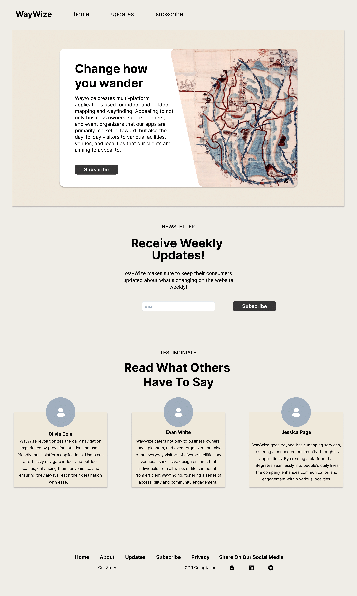

# FIGMA Designs

## FIGMA Design 1

- 

This design was created NOT following along with the user stories so that my partner and I could see how the overall design felt.

## FIGMA Design 2

- 

This design was created following along with the user stories, in order to see how the overall flow of the design would change from the previous one.