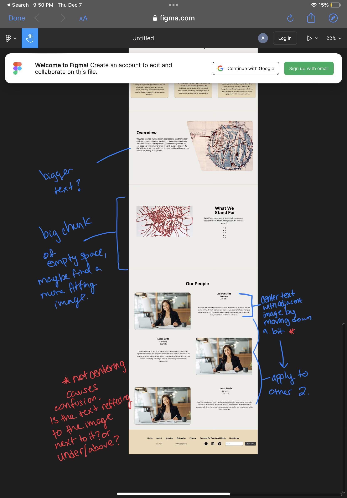
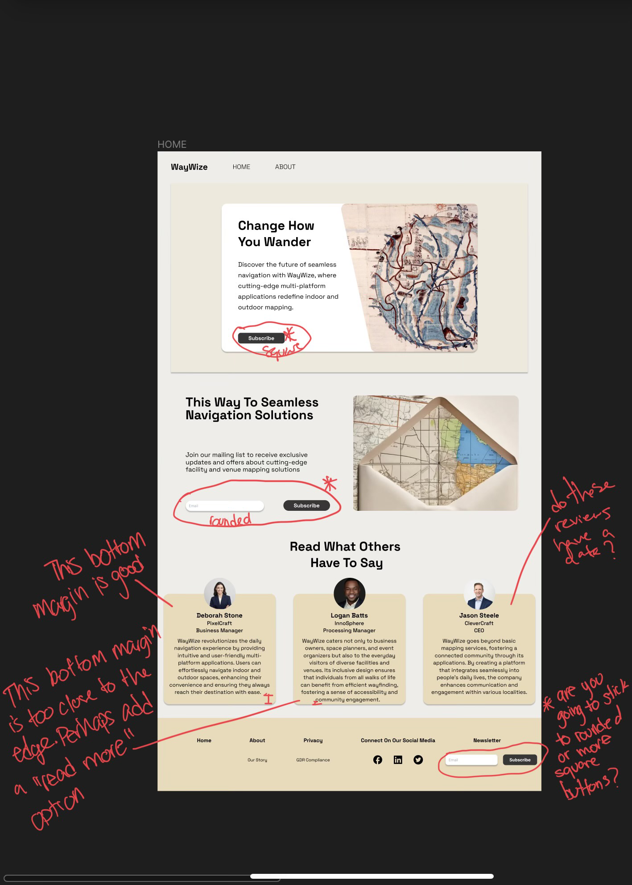
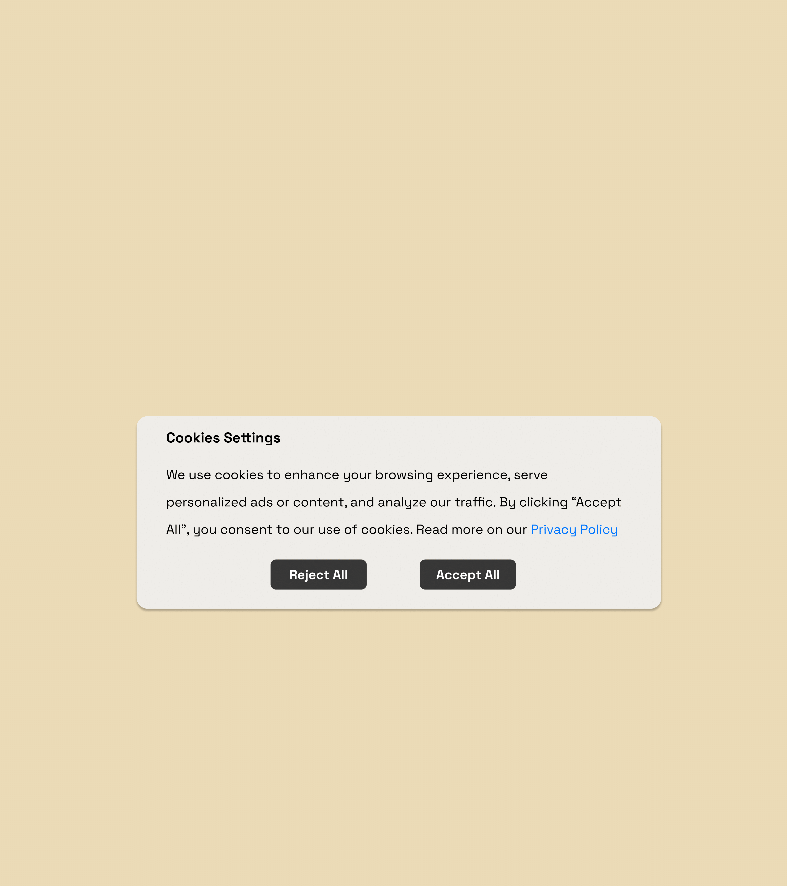

# UX Research Report

- 

- 

These were the iterations I had started with at the beginning of this project. I had chosen to keep the overall design of the project the same, however, I wanted to pick two different colors to see which one the people I had shown my design to would like best. Overall, the people I had shown my design to liked the brownish colorway first, however, they thought that it made the text harder to read and that I should try to change the font color. Overall, the lighter design was my favorite, so my next step was changing the design to the brown colorway to look similar to the lighter one, while also adjusting the design to what the people had said.

- 

- 

This then led me to create these two designs. Adding minimal changes to the lighter version of the design, however, adding a distinct footer section. The most changes came within the brown design, changing the font, and adding another color so that things would pop out. However, after further tests with people, they had gathered that yes the brown design was a nice color, but it would probably be best to pick the lighter one because it was easier on the eyes, and it made it a lot easier for users to read the text that was being shown to them.

- 

- 

Now, I was trying to figure out if I wanted the design to be one page, or two. The first iteration shows the design is two pages, the home screen user would see first, and then the user would later navigate to the About page of our website. Then I created a design if everything was on one page. Overall, I had gotten feedback that the iteration with two pages was a lot better because they started to lose interest with all the information being on one page. With this done, I could focus on being able to design two pages.

- 

- 

Finally, the design is coming to a close, and these were the final feedback thoughts I had on the iteration before the design was complete. It was minor details that I had missed or more text-based feedback but it was important. Especially with the buttons, I had not noticed that I had rounded some more than usual. The overall feedback was very helpful, which led to the final design that I am now going to show below!

- 
- 
- 
- 